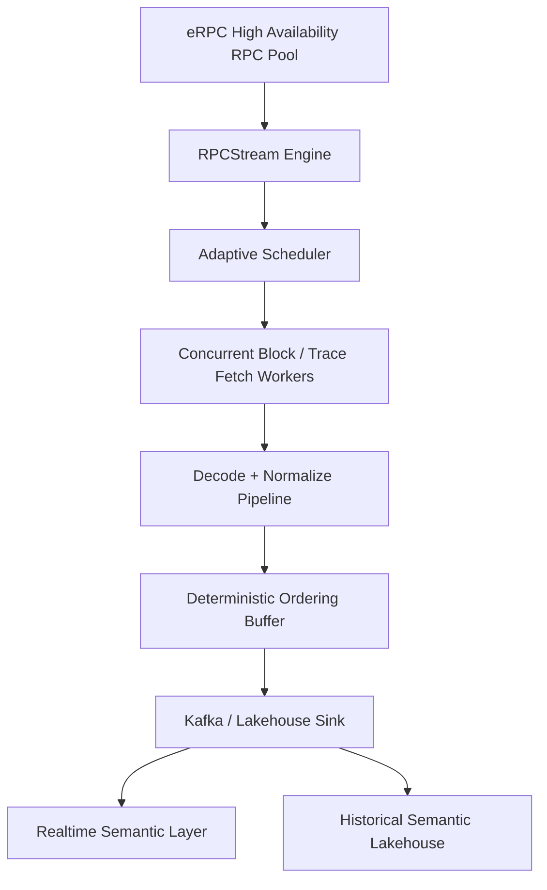

# Chainlake Flow

**Chainlake Flow** is a blockchain-native streaming ingestion system for realtime and historical blockchain data.

Powered by **RPCStream Engine**, it delivers deterministic block streams over high-availability RPC pools — without requiring self-hosted archive nodes.

> Deterministic blockchain streams over RPC.

---

## Why Chainlake Flow

Most blockchain data pipelines rely on:

* full archive nodes
* local chain file access
* offline ETL workflows
* batch-oriented exports

Chainlake Flow takes a different approach:

* RPC-native streaming
* adaptive async concurrency
* deterministic ordered delivery
* realtime + backfill on the same runtime

This makes blockchain ingestion lighter, cheaper, and easier to scale.

---

## Core Capabilities

* ultra-low latency realtime ingestion
* high-throughput historical backfill
* ordered block processing
* adaptive RPC scheduling
* Kafka-native downstream delivery
* multi-chain extensibility

---

## Unified Streaming Model

Chainlake Flow runs both modes on the same engine:

### Bounded Stream

Historical block-range replay.

### Unbounded Stream

Realtime latest-block tailing.

No duplicated ingestion path.

---

## Architecture



---

## Project Structure

```bash
chainlake-flow/
├── cli/                  # command entrypoints
├── scripts/              # local tooling
├── docs/                 # design docs
├── tests/                # integration / benchmark tests
│
├── rpcstream/            # RPCStream Engine core
│   ├── rpc/              # rpc transport + eRPC client
│   ├── scheduler/        # chain adapters
│   ├── planner/          # block planning
│   ├── execution/        # fetch + decode
│   ├── runtime/          # scheduler + runtime loop
│   ├── state/            # checkpoint / cursor / replay
│   ├── sinks/            # kafka / storage outputs
│   ├── metrics/          # telemetry
│   ├── models/           # domain schema
│   └── utils/
│
├── pyproject.toml
├── README.md
└── LICENSE
```

---

## Supported Chains

### EVM (current)

* Ethereum
* BNB Chain
* Polygon

### Planned

* Sui
* Aptos
* Solana

---

## Run

### Realtime

```bash
python cli/realtime.py --chain bsc --start-block latest
```

### Backfill

```bash
python cli/backfill.py --chain bsc --start-block 90000000 --end-block 90001000
```

---

## Output Targets

Designed for:

* Apache Kafka
* Apache Iceberg
* ClickHouse

---

## Positioning

Chainlake Flow is not a traditional blockchain ETL exporter.

It is designed as:

> a deterministic blockchain streaming runtime

for semantic data systems and realtime blockchain lakehouses.

---

## Roadmap

* stricter ordering buffer
* adaptive concurrency controller
* multi-region RPC routing
* non-EVM adapter framework
* semantic-native sinks

Detailed design notes live under `docs`.
