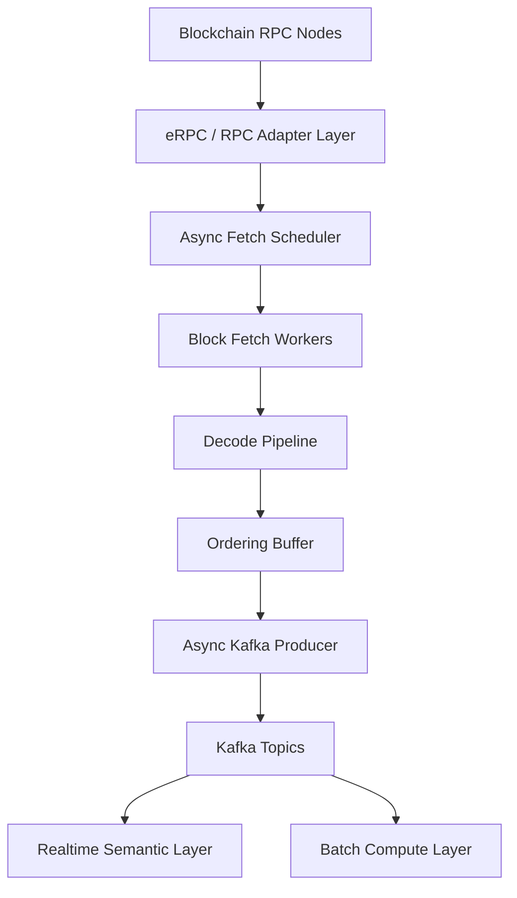
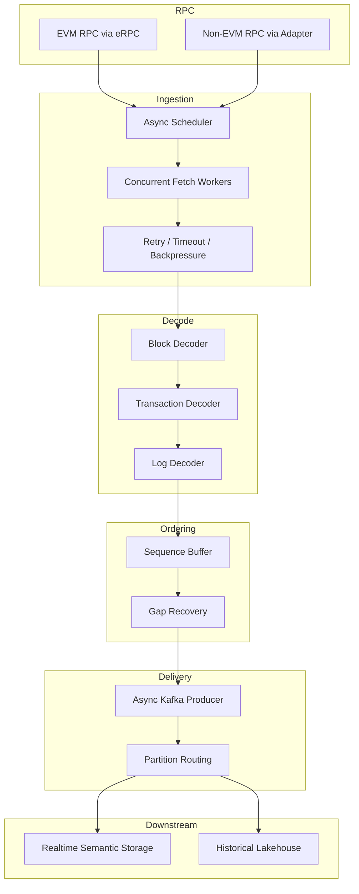

# Blockchain Ingestion Engine

`blockchain-ingestion-engine` is the core ingestion engine of **Chainlake**, designed for modern blockchain data infrastructure.

It provides:

- ultra-low latency stream ingestion
- high throughput historical backfill
- ordered block processing
- async RPC concurrency
- Kafka-native downstream delivery
- multi-chain extensibility (EVM + future non-EVM)

Unlike traditional ETL-oriented blockchain extractors, `blockchain-ingestion-engine` is built for both:
* **continuous realtime semantic pipelines**
* **large-scale historical data ingestion**

# Why This Project Exists

Most existing blockchain ETL tools were designed for:
- historical export
- offline analytics
- CSV / JSON dumps
- batch pipelines

They are not optimized for:
- high throughput backfill
- async concurrency
- realtime ingestion
- Kafka-native stream processing
- semantic data freshness

`blockchain-ingestion-engine` solves both problems:
## Realtime
Low-latency block ingestion for semantic freshness.

## Historical
High-throughput backfill for full-chain reconstruction.

# Core Design Goals

## Unified Stream + Backfill Engine
Same ingestion core supports:
- realtime streaming
- historical backfill
No duplicated code path.

## Stream First but Batch Strong
- Realtime guarantees freshness.
- Backfill guarantees full-chain completeness.
Both are first-class citizens.

## Ordered Output Guarantee

Even under async concurrency:
- block ordering preserved
- downstream deterministic sequence maintained

## Horizontal Scalability
Can scale by:
- block partition
- chain partition
- topic partition

## Multi-Chain Future

Supports:
### EVM now
Examples:
- Ethereum
- BNB Chain
- Polygon

### Non-EVM future:
Planned:
- Sui
- Aptos
- Solana

# High-Level Architecture


# Architecture V3 (Production Model)



# Project Structure
```bash
blockchain-ingestion-engine/
├── cli/                          # Command-line entry
│   ├── backfill.py               # Historical batch import entry
│   ├── realtime.py               # Real-time streaming entry
│   ├── logs.py                   # Logs-specific entry
│   └── benchmark.py              # Benchmarking tool
│
├── blockchain-ingestion/             # Main package
│   │
│   ├── adapters/                 # Chain adapter layer (core future extension layer)
│   │   ├── evm/
│   │   │   ├── rpc_adapter.py
│   │   │   ├── parser.py
│   │   │   └── schema.py
│   │   │
│   │   ├── sui/
│   │   │   ├── rpc_adapter.py
│   │   │   ├── parser.py
│   │   │   └── schema.py
│   │   │
│   │   ├── aptos/
│   │   │   ├── rpc_adapter.py
│   │   │   ├── parser.py
│   │   │   └── schema.py
│   │   │
│   │   └── base.py               # Adapter abstract interface
│   │
│   ├── rpc/                      # RPC transport layer
│   │   ├── erpc_client.py
│   │   ├── async_client.py
│   │   ├── retry.py
│   │   ├── rate_limit.py
│   │   └── timeout.py
│   │
│   ├── planner/                  # Block planning layer
│   │   ├── range_planner.py
│   │   ├── block_window.py
│   │   └── stream_cursor.py
│   │
│   ├── runtime/                  # Async runtime core
│   │   ├── engine.py             # Main runtime loop
│   │   ├── scheduler.py          # Inflight task scheduler
│   │   ├── dispatcher.py         # Range/task dispatch
│   │   └── lifecycle.py          # Runtime lifecycle
│   │
│   ├── execution/                # Execution layer
│   │   ├── fetcher.py            # Async fetch block/log/tx
│   │   ├── parser_executor.py
│   │   ├── ordered_buffer.py
│   │   └── result_merger.py
│   │
│   ├── state/                    # State management layer
│   │   ├── checkpoint.py
│   │   ├── range_registry.py
│   │   ├── cursor_store.py
│   │   └── replay_state.py
│   │
│   ├── sinks/                    # Output layer
│   │   ├── kafka/
│   │   │   ├── producer.py
│   │   │   ├── eos.py
│   │   │   └── serializer.py
│   │   │
│   │   ├── storage/
│   │   │   ├── parquet_writer.py
│   │   │   ├── iceberg_writer.py
│   │   │   └── clickhouse_writer.py
│   │   │
│   │   └── base.py
│   │
│   ├── metrics/                  # Full-stack monitoring
│   │   ├── definitions.py
│   │   ├── runtime.py
│   │   ├── exporter.py
│   │   └── tracing.py
│   │
│   ├── models/                   # Domain model (unified schema)
│   │   ├── block.py
│   │   ├── transaction.py
│   │   ├── log.py
│   │   └── receipt.py
│   │
│   ├── utils/
│   │   ├── logging.py
│   │   ├── time.py
│   │   └── misc.py
│   │
│   └── config/
│       ├── settings.py
│       ├── chain_config.py
│       └── sink_config.py
│
├── deployments/                  # Deployment configurations
│   ├── k8s/
│   │   ├── realtime.yaml
│   │   ├── backfill.yaml
│   │   └── logs.yaml
│   │
│   ├── docker/
│   │   └── Dockerfile
│   │
│   └── helm/
│
├── tests/
│   ├── adapters/
│   ├── runtime/
│   ├── planner/
│   ├── sinks/
│   └── integration/
│
├── scripts/
│   ├── local_run.sh
│   ├── benchmark.sh
│   └── smoke_test.sh
│
├── pyproject.toml
├── README.md
└── LICENSE
```

# Core Features

## Async RPC Fetching
- high concurrency
- adaptive worker pools
- latency aware

## Ordered Block Delivery
- sequence buffer
- gap recovery

## Async Kafka Producer
- high throughput
- partition aware
- non-blocking delivery

## RPC Reliability via eRPC
Uses:
- timeout
- retry
- circuit breaker
- provider failover

# Key Difference from Traditional ETL
Traditional ETL:
- export-oriented
- offline-first
- synchronous RPC
- limited throughput

Blockchain Ingestion Engine:
- async-first
- stream-native
- backfill-optimized
- Kafka-ready
- horizontally scalable

# Planned Features
## Redis Ordering Buffer
for large-scale strict ordering

## Multi-region RPC routing
## Adaptive concurrency controller
## chain-specific parser plugins

---

# Supported Modes

## Realtime Stream Mode

Optimized for:

- latest block ingestion
- low-latency semantic updates

Example Run:
```bash
python cmd/cli.py \
  --chain bsc \
  --mode stream \
  --start-block latest
```
Output Topics:
Examples:
```text
blocks
transactions
logs
erc20_transfers
erc721_transfers
erc1155_transfers
```

## Batch Backfill Mode

Optimized for:

- large historical range export
- maximum throughput

# Downstream Integration

Designed for:
- Apache Kafka
- Apache Spark
- Apache Iceberg
- ClickHouse

# realtime semantic freshness

Without low-latency ingestion, semantic layer always lags.

This project ensures:
- semantic freshness
- low compute delay
- scalable chain expansion

# Future Roadmap

## v0.1 (WIP)
- EVM stable runtime
- Kafka sink
- ordered buffer

## v0.2
- Prometheus metrics
- OpenTelemetry traces
- Loki logs

## v0.3
- Parquet / Iceberg sink
- replay state persistence

## v0.4
- Redis ordering
- non-EVM adapter framework

## v0.5
- unified semantic ingestion engine
- exactly-once end-to-end delivery

## v1.0
- production multi-chain release

---

# Positioning

Blockchain Ingestion Engine is not a traditional ETL exporter.

It is designed as:

> blockchain Ingestion runtime infrastructure

for modern semantic data systems.

---

# License

Apache-2.0
