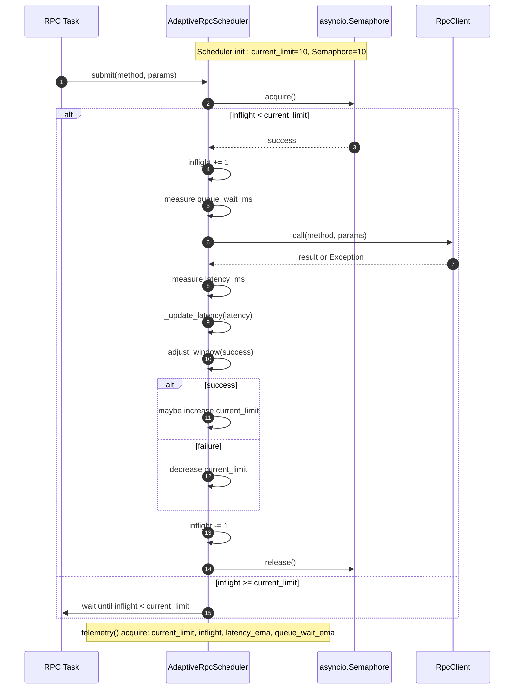

```mermaid
sequenceDiagram
    autonumber
    participant Task as RPC Task
    participant Scheduler as AdaptiveRpcScheduler
    participant Semaphore as asyncio.Semaphore
    participant RpcClient as RpcClient

    Note over Scheduler,Semaphore: Scheduler init : current_limit=10, Semaphore=10

    Task->>Scheduler: submit(method, params)
    Scheduler->>Semaphore: acquire()
    alt inflight < current_limit
        Semaphore-->>Scheduler: success
        Scheduler->>Scheduler: inflight += 1
        Scheduler->>Scheduler: measure queue_wait_ms
        Scheduler->>RpcClient: call(method, params)
        RpcClient-->>Scheduler: result or Exception
        Scheduler->>Scheduler: measure latency_ms
        Scheduler->>Scheduler: _update_latency(latency)
        Scheduler->>Scheduler: _adjust_window(success)
        alt success
            Scheduler->>Scheduler: maybe increase current_limit
        else failure
            Scheduler->>Scheduler: decrease current_limit
        end
        Scheduler->>Scheduler: inflight -= 1
        Scheduler->>Semaphore: release()
    else inflight >= current_limit
        Scheduler->>Task: wait until inflight < current_limit
    end

    Note over Scheduler: telemetry() acquire: current_limit, inflight, latency_ema, queue_wait_ema

```