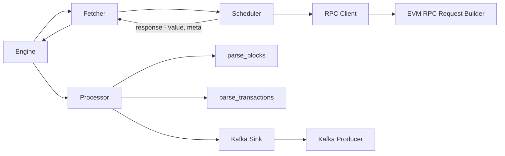
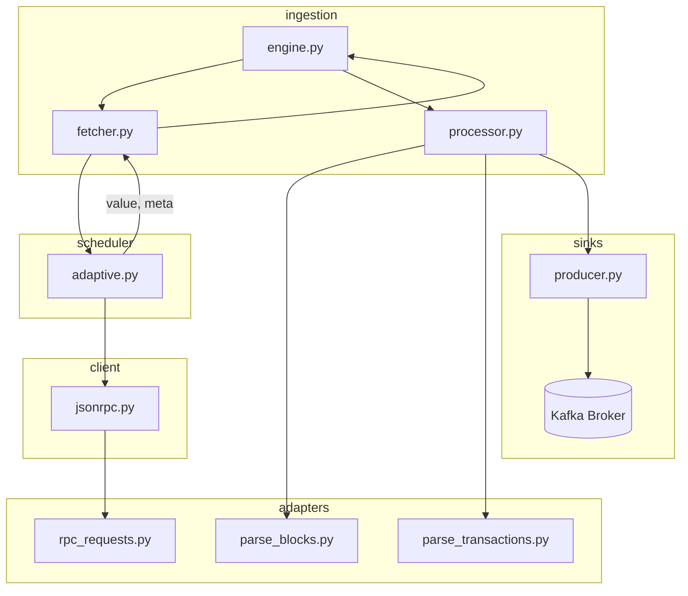
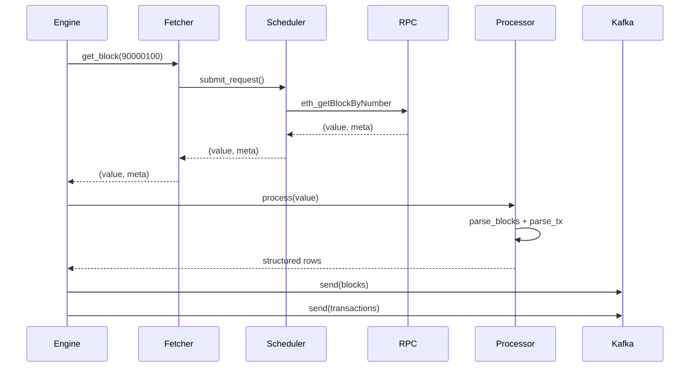

# High-level flow

# Detailed flow

# Block lifecycle

## Layer Responsibility
| Layer     | Responsibility |
| --------- | -------------- |
| Engine    | orchestration  |
| Fetcher   | get raw data   |
| Processor | transform      |
| Sink      | deliver        |
